# Setup

1. Include the sqlite-jbc-x.xx.x.x.jar file in your project.
2. Duplicate src/db/SpaceShooter_empty.db to src/db/SpaceShooter.db

Spaceshooters version: 1.0-alpha

## Table of contents
-----------------------
- Introduction
- Controlls
- The base mechanics 
- Score system
- Goal
- Levels
- Upgrades
- Health/shield
- Ammunition
- Actors
    - Spaceship
    - Aliens
    - Bullets
    - Upgrade
    - UI
- The Spaceshooter Team

## Introduction
-----------------------
Spaceshooter is a 2D game, in which the player, playing as a heavily armed spaceship, has to defeat waves of aliens. 
In order to survive, there are different powerups, health and shield items, which can be collected after killing the aliens. 
After defeating each wave, the game is getting harder and harder. 
The main goal is to get the highest score of all time, but if you the player dies, he has to start all over again. 

## Controls
-----------------------
To move the playing spaceship, there will be 4 keys needed. WASD
`W` - move up
`S` - move down
`A` - move lefts
`D` -  move right
In order to shoot, press `space`

## The base mechanics 
-----------------------
This paragraph will give you a quit introduction into the game mechanics and each important part of the game. 

## Scoresystem

Points can be gathered by killing aliens. The amount of points received, is depending on the level of the alien. The higher the level of the alien, the highter are the reveiced points. 
In order to keep track of the scores, theres a local database, in which the player can save his current score after each game.

## Goal

The goal of the game is to survive as long as possible and to get the highest score possible. 

## Levels

Each alienwave represents one level.
In order to complete a level, all aliens on the current screen have to be eliminated. 
If the player manages to complete the level, he will be teleported into the next one. 
The difficulty of the levels will increase after every beaten wave/level. 

## upgrades

After defeating an alien, theres a chance that the killed alien will drop an item, as health, shield or another weapon. These items will start falling along the Y-axis, in direction of the player. In order to gain the ability of the powerup, the player has to collect it by flying into the falling powerup. 
The collected powerup will remain a specific amount of time, after this it will automatically be removed. (not including health or shield items) 

## Health/shield
The player starts the game with 3 heartpoints, and 0 shields.
Theres a maximum of 4 heartpoints and 3 shields.
The player will be able to collect the items and increase his health or/and shieldpoints, by the amount of collected items. (max 4 health, 3 shield)
If the player gets hit by an alien, one health or shieldpoint will be lost. Shields will always be lost first, if there are not shield items collected, heartpoints will be lost. 

## Amunition

The player will have a limited amount of amunition. However, there will be single bullets flying towards the player, which can be picked up to gain more munition. For each collected bullet, the player will gain +1 amunition. 
Standard attacks will use 1 amunition per shot, while other powerups can use more per shot. 
If the player reaches a value of 0 amunition, he will not be able to shoot and do damage. Bullets have to be collected.

## Actors
-----------------------

## Spaceship
The spaceship is controlled by the player, it is the main part of the game. 
The spaceship is designed to eliminate the aliens with different weapons and powerups. 
The spaceship is a selfmade custom pixel creation, with custom deathsound and different bullet animations. 

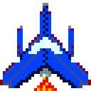

## Aliens
The aliens represent the enemy. They are shotting at the player and try to make damage. 
There are 6 different aliens in the game - which are grouped in biologic and mechanic aliens.
Each of this groups has an own custom deathsound and deathanimation.
Each alien has a level, which changes from wave to wave.
The aliens will shoot in a random interval in the direction of the spaceship - straight Y-axis 

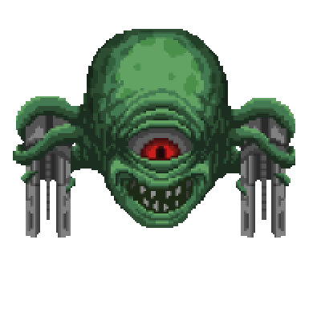
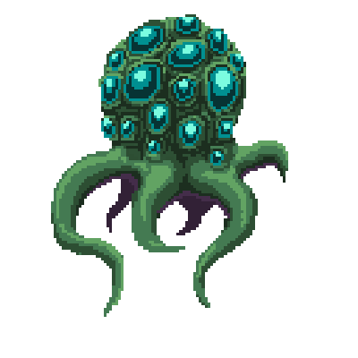
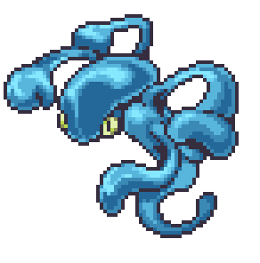
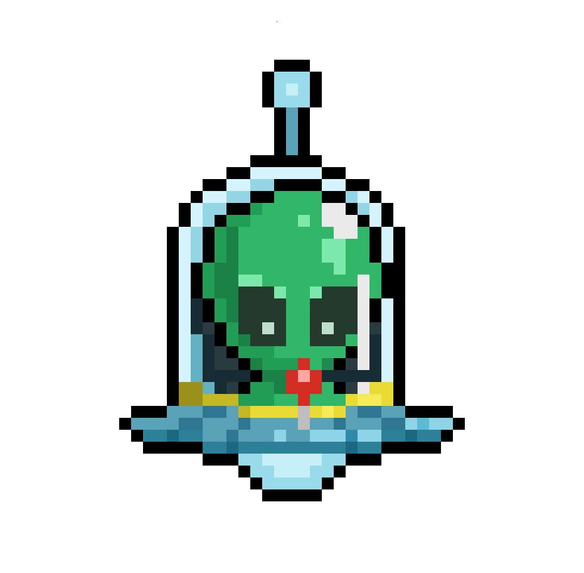
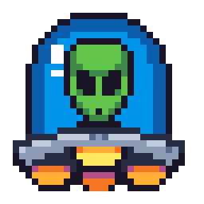
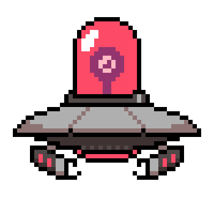

## Bullets
There are 5 different kinds of bullets in the game. 
For each of this bullets, there is a custom impact animation and sound. 
The bullets are different in speed, damange, size, explosionsize and explosiondamage.

| Name    | Description                                                  | Picture                                |
| ------- | ------------------------------------------------------------ | -------------------------------------- |
| Default | This is the standart bullet, it is used when no perk is collected. |  |
| Rocket  | The rocket is the fastest one, it does a lot of impact damange therefore less explosion damage. | 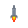 |
| Bomb    | This bullet has the highest explosiondamage.                 | 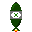 |
| Missile | This rocket, has a target searching ability.                 | 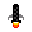 |
| Nuke    | This rocket has by far the biggest explosionsize and hits multiple enemies accordingly. | 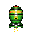 |

## Upgrade
There are different upgrades for your spaceship, which can help the player to defeat the aliens. 
Upgrades can be spawned on a small percentage after killing an alien.
Each of these items will only be available for a limited time to the player. 

| Name              | Description                                                 | Picture |
| ----------------- | ----------------------------------------------------------- | ------- |
| NOS               | Gives the player a speedboost                               ||
| Firerate         | Incerases the firerate of the player | 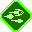        |
| Fastbullet          | Increases the flight speed of the bullet                          |         |
| Damage | Increases the damage dealt by each bullet                        | 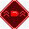        |
| Bigbullet         | enlarges the bullet                                         |         |
| 

## UI
The UI is here to give u an overview of your current perks, healthstatus and remaining amunition and more. 
Sound: with the sound button, it is possible to mute/unmute the game sound.
Sore: the current score is shown, refreshing after every point receivement. 
Hearts: the hearts give information about how many hits can still be takin from enemies, hearts can only be lost if there are no shields available.
Shield: the shield is the previous perk of the hearts, it works the same way, despite that the shields will be lost before the hearts.
Amunition: the amunition is labeled with a number, which shows how many shots are still available to the player, can be increased by picking up bullets in the field.
Perks: perks which have been collected and are therefore active, are shown on the right side. If the right side is empty, no perk is collected/active.

## The Spaceshooter Team
--------------
Spaceshooter is being developed by:
Technische Berufsschule Zürich: Elio Teuber, Seraphin Dick

The copyright (c) for Spaceshooter is held by E. Teuber and S. Dick.

