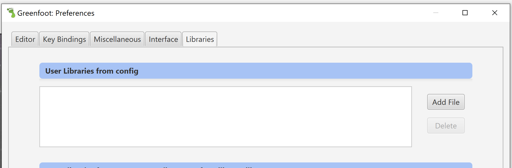
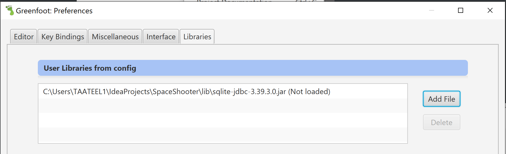
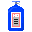

# Space Shooter

 

The game is still under development. Feel free to contribute or try it out. To see how you can set it up locally, please see the [Setup](#Setup) chapter.

Note: This branch is a simplified version of the game, which can be deployed on the greenfoot gallery.

# Introduction
Space Shooter is a 2D game, in which the player, playing as a heavily armed spaceship, has to defeat waves of aliens. 
In order to survive, there are different powerups, health and shield items, which can be collected after killing the aliens. 
After defeating each wave, the game is getting harder and harder.
The main goal is to get the highest score of all time, but if you the player dies, he has to start all over again.

# Setup

1. Download the .gfar file from the latest Release. Open the downloaded file with Greenfoot

2. Include the sqlite-jbc-x.xx.x.x.jar file in your project
   1. Download the library file: [sqlite-jdbc-3.39.3.0.jar](https://github.com/EloiMusk/SpaceShooter/raw/master/lib/sqlite-jdbc-3.39.3.0.jar)
   2. Open Preferences in Greenfoot:
      
   3. Go to libraries and click "Add File":
      
   4. Select the downloaded file or if you cloned the repository, you can also select the file from ./lib:
      
   5. Now click "Okey" and restart the application

3. (If run from source code) Duplicate src/db/SpaceShooter_empty.db to src/db/SpaceShooter.db

# Controls
To move the playing spaceship, there will be 4 keys needed. "WASD"
`W` - move up
`S` - move down
`A` - move lefts
`D` -  move right
In order to shoot, press `space`

# The base mechanics 
This paragraph will give you a quit introduction into the game mechanics and each important part of the game. 

## Score System

Points can be gathered by killing aliens. The amount of points received, is depending on the level of the alien. The higher the level of the alien, the highter are the reveiced points. 
In order to keep track of the scores, theres a local database, in which the player can save his current score after each game.

## Goal

The goal of the game is to survive as long as possible and to get the highest score possible. 

## Levels

Each alien wave represents one level.
In order to complete a level, all aliens on the current screen have to be eliminated. 
If the player manages to complete the level, he will be teleported into the next one. 
The difficulty of the levels will increase after every beaten wave/level. 

## Upgrades

After defeating an alien, theres a chance that the killed alien will drop an item, as health, shield or another weapon. These items will start falling along the Y-axis, in direction of the player. In order to gain the ability of the powerup, the player has to collect it by flying into the falling powerup. 
The collected powerup will remain a specific amount of time, after this it will automatically be removed. (not including health or shield items) 

## Health/shield
The player starts the game with 3 heart points, and 0 shields.
Theres a maximum of 4 heart points and 3 shields.
The player will be able to collect the items and increase his health or/and shield points, by the amount of collected items. (max 4 health, 3 shield)
If the player gets hit by an alien, one health or shieldpoint will be lost. Shields will always be lost first, if there are not shield items collected, heartpoints will be lost. 

## Ammunition

The player will have a limited amount of ammunition. However, there will be single bullets flying towards the player, which can be picked up to gain more munition. For each collected bullet, the player will gain +1 ammunition. 
Standard attacks will use 1 ammunition per shot, while other power ups can use more per shot. 
If the player reaches a value of 0 ammunition, he will not be able to shoot and do damage. Bullets have to be collected.

# Actors

Here you can find some information about the different Characters of the game.

## Spaceship
The spaceship is controlled by the player, it is the main part of the game. 
The spaceship is designed to eliminate the aliens with different weapons and powerups. 
The spaceship is a selfmade custom pixel creation, with custom death sound and different bullet animations. 

## Aliens
The aliens represent the enemy. They are shotting at the player and try to make damage. 
There are 6 different aliens in the game - which are grouped in biologic and mechanic aliens.
Each of this groups has an own custom death sound and death animation.
Each alien has a level, which changes from wave to wave.
The aliens will shoot in a random interval in the direction of the spaceship - straight Y-axis 

## Bullets

There are 5 different kinds of bullets in the game. 
For each of this bullets, there is a custom impact animation and sound. 
The bullets are different in speed, damage, size, explosion size and explosion damage.

| Name    | Description                                                  | Picture                                                      |
| ------- | ------------------------------------------------------------ | ------------------------------------------------------------ |
| Default | This is the standard bullet, it is used when no perk is collected. |  |
| Rocket  | The rocket is the fastest one, it does a lot of impact damage therefore less explosion damage. |  |
| Bomb    | This bullet has the highest explosion damage.                |  |
| Missile | This rocket, has a target searching ability.                 |  |
| Nuke    | This rocket has by far the biggest explosion size and hits multiple enemies accordingly. |  |

## Upgrade
There are different upgrades for your spaceship, which can help the player to defeat the aliens. 
Upgrades can be spawned on a small percentage after killing an alien.
Each of these items will only be available for a limited time to the player. 

| Name              | Description                                                 | Picture |
| ----------------- | ----------------------------------------------------------- | ------- |
| NOS               | Gives the player a speed boost                    ||
| Fire rate | Increases the fire rate of the player |         |
| Bullet Speed | Increases the flight speed of the bullet                          |         |
| Damage | Increases the damage dealt by each bullet and adds a temporary damage boost. |         |
| Bullet Size | Enlarges the bullet                                        |         |

## UI
The UI is here to give u an overview of your current perks, health status and remaining ammunition and more. 
Sound: with the sound button, it is possible to mute/unmute the game sound.
Sore: the current score is shown, refreshing after every point receivement. 
Hearts: the hearts give information about how many hits can still be takin from enemies, hearts can only be lost if there are no shields available.
Shield: the shield is the previous perk of the hearts, it works the same way, despite that the shields will be lost before the hearts.
Ammunition: the ammunition is labeled with a number, which shows how many shots are still available to the player, can be increased by picking up bullets in the field.
Perks: perks which have been collected and are therefore active, are shown on the right side. If the right side is empty, no perk is collected/active.

## The Space Shooter Team
SpaceShooter is being developed by:
Technische Berufsschule Zürich

@EloiMusk @xeraphyn

